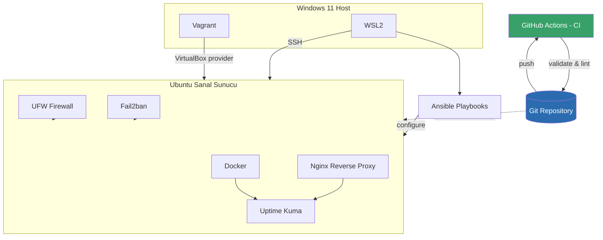

# GitOps & Infrastructure as Code — Öğrenme Günlüğü


> Bu repo, **[gitops-iac-project](https://github.com/lhasanseker/gitops-iac-project)** adlı çalışan projeyi geliştirirken edindiğim GitOps ve IaC bilgisini yapılandırılmış notlar halinde belgelediğim bir **öğrenme arşividir**. Amaç, hem kendi geri dönüşüm kaynağım olması hem de aynı yolda ilerleyen başkalarına rehberlik etmesi.

---

## 📌 İçindekiler

| # | Bölüm | Açıklama |
|---|-------|----------|
| 1 | [Projenin Amacı](docs/01-giris.md) | Neden bu projeyi yaptım, ne öğrenmeyi hedefledim |
| 2 | [Genel Mimari](docs/02-mimari.md) | Vagrant, WSL, VirtualBox, Ansible ilişkisi (Mermaid diyagramlı) |
| 3 | [IaC Nedir?](docs/03-iac-nedir.md) | Infrastructure as Code kavramı, kendi cümlelerimle |
| 4 | [Vagrant & VirtualBox](docs/04-vagrant-virtualbox.md) | Sanal sunucu tanımı ve provisioning |
| 5 | [Ansible ile Konfigürasyon](docs/05-ansible.md) | Playbook, role, idempotency |
| 6 | [Docker & Nginx](docs/06-docker-nginx.md) | Uptime Kuma container'ı, reverse proxy |
| 7 | [Sunucu Güvenliği](docs/07-guvenlik.md) | UFW, Fail2ban, temel hardening |
| 8 | [CI ile Kod Kontrolü](docs/08-ci-cd.md) | GitHub Actions, lint/validate pipeline |
| 9 | [GitOps: Push vs Pull](docs/09-gitops-pull-based.md) | Pull tabanlı GitOps mantığı, Argo CD & Flux karşılaştırması |
| 10 | [Self-Healing & Disaster Recovery](docs/10-self-healing-disaster-recovery.md) | Servis kurtarma ve tam yıkıp-yeniden-kurma testleri |
| 11 | [Referans Projeler & İleri Seviye Konular](docs/11-referans-projeler.md) | Kustomize, Helm, App-of-Apps, progressive delivery, incelenecek örnek repolar |

---

## 🗺️ Sistem Mimarisi (özet)



Detaylı anlatım için: [`docs/02-mimari.md`](docs/02-mimari.md)

---

## 🧰 Kullanılan Araçlar

| Katman | Araç | Ne İşe Yarar |
|--------|------|---------------|
| Sanallaştırma | **Vagrant + VirtualBox** | Tekrarlanabilir sanal sunucu tanımı |
| Konfigürasyon Yönetimi | **Ansible** | Sunucu kurulumunu kod ile otomatikleştirme |
| Konteynerleştirme | **Docker** | Uygulamaları izole ortamda çalıştırma |
| Erişim / Proxy | **Nginx** | Servislere güvenli erişim yönlendirme |
| Güvenlik | **UFW, Fail2ban** | Temel ağ ve brute-force koruması |
| CI | **GitHub Actions** | Altyapı kodunu otomatik doğrulama |
| GitOps Mantığı | **Pull-based reconciliation** | Git'i tek doğruluk kaynağı (single source of truth) olarak kullanma |

> 💡 Bu repo öğrenme amaçlı olarak **Argo CD veya Flux gibi bir GitOps operatörü kullanmıyor**; pull-mantığı manuel/cron tabanlı script ile simüle ediliyor. Gerçek dünyada bu iş genelde Argo CD veya Flux'a devredilir — bkz. [`docs/11-referans-projeler.md`](docs/11-referans-projeler.md).

---

## 📂 Klasör Yapısı

```text
gitops-learn/
├── docs/                     # Konu bazlı öğrenme notları (bu repo)
├── examples/                 # Argo CD / Flux / Kustomize kavramsal örnekleri
│   ├── argocd/
│   ├── flux/
│   └── kustomize/
│       ├── base/
│       └── overlays/{dev,prod}/
├── images/                    # Diyagram ve ekran görüntüleri
├── .github/
│   ├── workflows/ci.yml       # Markdown lint + link check
│   └── ISSUE_TEMPLATE/
├── CONTRIBUTING.md
└── LICENSE
```

---

## 🚀 Çalışan Proje

Bu repo bir **rapor/not deposudur**, çalışan kodun kendisi değildir. Gerçek altyapı kodu:

➡️ **[lhasanseker/gitops-iac-project](https://github.com/lhasanseker/gitops-iac-project)**

---

## 🤝 Katkı

Yazım/anlatım hataları, eksik konular veya öneri için lütfen [CONTRIBUTING.md](CONTRIBUTING.md) dosyasına bakın ve bir issue açın.

## 📄 Lisans

Bu içerik [MIT Lisansı](LICENSE) ile paylaşılmıştır — dilediğiniz gibi kullanabilir, fork'layıp kendi notlarınızı ekleyebilirsiniz.
