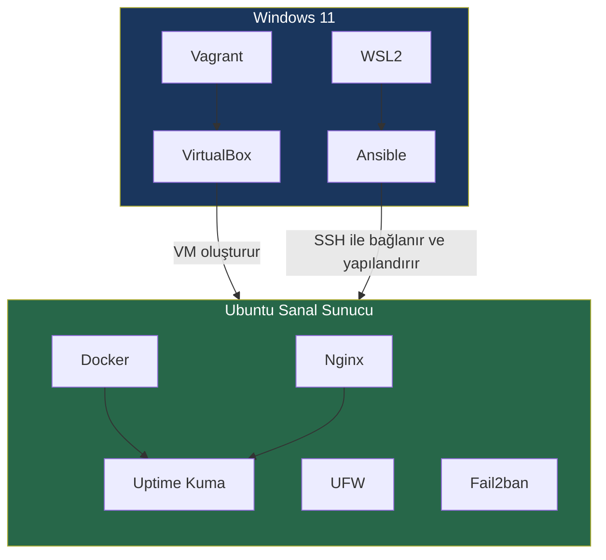

← [README'ye dön](../README.md) | [◀ Önceki: Projenin Amacı](01-giris.md)

# 2. Genel Mimari

Projeyi ilk öğrenirken en çok karıştırdığım konu **WSL, Vagrant, VirtualBox ve Ansible'ın birbiriyle ilişkisi** oldu. Bu bölümde bunu netleştirmeye çalışıyorum.

## Bileşenlerin Rolü

| Bileşen | Nerede Çalışır | Görevi |
|---------|-----------------|--------|
| **Vagrant** | Windows (host) | Sanal makinenin tanımını (Vagrantfile) okuyup VirtualBox'a "şu VM'i şu ayarlarla oluştur" der |
| **VirtualBox** | Windows (host) | Vagrant'ın arkasında gerçek sanallaştırmayı yapan hypervisor |
| **WSL2** | Windows (host) | Linux benzeri bir kabuk; Ansible'ı buradan çalıştırıyorum |
| **Ansible** | WSL2 içinden | SSH üzerinden Ubuntu VM'ine bağlanıp yapılandırmayı uyguluyor |
| **Ubuntu VM** | VirtualBox içinde | Asıl "sunucu"; Docker, Nginx, Uptime Kuma, UFW, Fail2ban burada çalışıyor |

## Akış Şeması

## Neden Bu Sırayla Çalışıyor?

1. **Vagrant** deklaratif bir dosyayla ("bana Ubuntu 22.04, 2 CPU, 2GB RAM ver") VM'in *tanımını* yapar.
2. **VirtualBox** bu tanımı gerçek bir sanal makineye çevirir — provisioning katmanı.
3. VM ayağa kalktıktan sonra iş **Ansible**'a geçer: işletim sistemi seviyesindeki *yapılandırmayı* (kullanıcılar, paketler, servisler) uygular.
4. Ansible'ı **WSL2** üzerinden çalıştırıyorum çünkü Ansible native olarak Linux/Unix ortamı bekler; Windows üzerinde doğrudan çalıştırmak ek katmanlar gerektirir.

> 🔑 **Önemli ayrım:** Vagrant "makineyi var eder", Ansible "makineyi yapılandırır". Bu ikisini karıştırmamak, IaC'nin katmanlarını anlamanın anahtarı.

---
➡️ Sonraki: [3. Infrastructure as Code (IaC) Nedir?](03-iac-nedir.md)
