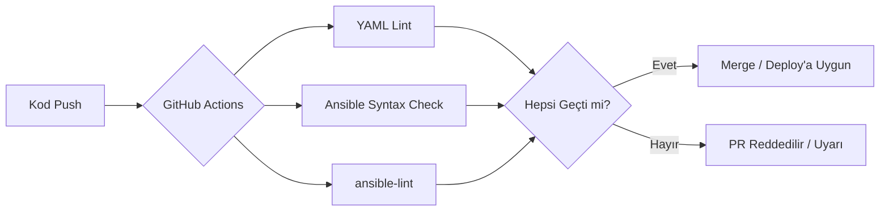

← [README'ye dön](../README.md) | [◀ Önceki: Sunucu Güvenliği](07-guvenlik.md)

# 8. GitHub Actions ile CI

Altyapı kodunu (Vagrantfile, Ansible playbook'ları) elle test etmek yerine, her push'ta otomatik doğrulama yapan bir **CI pipeline** kurdum.

## Neden CI Bu Projede Önemli?

GitOps'ta Git tek doğruluk kaynağıysa, Git'e giren her değişikliğin **doğru ve güvenli** olduğundan emin olmak gerekir. CI burada bir "kapı bekçisi" görevi görüyor:



## Kullandığım Kontroller

```yaml
name: Infrastructure CI

on:
  push:
    branches: [main]
  pull_request:

jobs:
  validate:
    runs-on: ubuntu-latest
    steps:
      - uses: actions/checkout@v4

      - name: YAML syntax kontrolü
        run: |
          pip install yamllint
          yamllint ansible/

      - name: Ansible playbook syntax kontrolü
        run: |
          pip install ansible ansible-lint
          ansible-playbook ansible/site.yml --syntax-check
          ansible-lint ansible/site.yml
```

## Öğrendiğim Ayrım: CI ≠ CD (burada)

Bu projede CI, kodu **doğruluyor** ama sunucuya otomatik **deploy etmiyor** — deploy adımı pull-tabanlı GitOps mantığıyla ayrı çalışıyor (bkz. [Bölüm 9](09-gitops-pull-based.md)). Bu ayrım önemli çünkü klasik CI/CD pipeline'larında CI sunucusunun cluster'a/sunucuya erişim yetkisi olması güvenlik riski taşır (push-based deployment). GitOps yaklaşımı bu riski, deploy sorumluluğunu sunucunun/cluster'ın kendisine (pull) devrederek azaltır.

---
➡️ Sonraki: [9. GitOps: Push vs Pull](09-gitops-pull-based.md)
