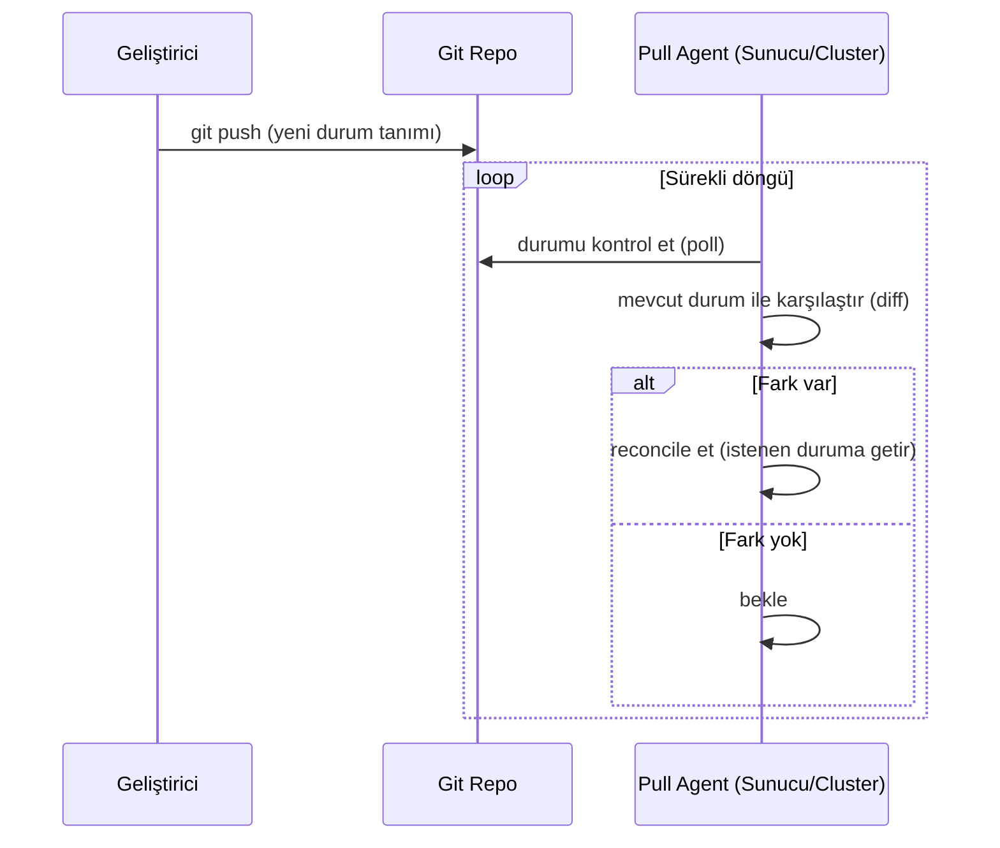

← [README'ye dön](../README.md) | [◀ Önceki: CI ile Kod Kontrolü](08-ci-cd.md)

# 9. GitOps: Pull Tabanlı Mantık

## GitOps Nedir? (Kendi Cümlelerimle)

GitOps, altyapı ve uygulama durumunun **tek doğruluk kaynağının (single source of truth) Git deposu** olduğu bir işletim modelidir. Sistemde bir değişiklik yapmak istediğimde sunucuya/cluster'a doğrudan müdahale etmem; Git'teki tanımı değiştiririm, sistem kendisi bu tanıma "yaklaşır" (reconcile eder).

## Push vs Pull: Aradaki Fark

Bu projede öğrendiğim en önemli kavramsal ayrım buydu:

| | **Push-Based** (klasik CI/CD) | **Pull-Based** (GitOps) |
|---|---|---|
| Kim tetikler? | CI sunucusu, hedefe **push** eder | Hedef sistem, Git'i **poll/watch** eder ve kendi çeker |
| Erişim yönü | CI → Sunucu/Cluster (CI'ın erişim yetkisi olmalı) | Sunucu/Cluster → Git (dış dünyaya açık kapı yok) |
| Güvenlik yüzeyi | Daha geniş (CI credential sızarsa cluster risk altında) | Daha dar (cluster credential'ları dışarı çıkmaz) |
| Drift tespiti | Genelde yok | Sürekli reconciliation ile drift otomatik tespit edilir/düzeltilir |
| Örnek araçlar | Jenkins + kubectl apply, GitHub Actions + ssh deploy | **Argo CD**, **FluxCD** |



## Bu Projede Nasıl Uyguladım

Bu repoda tam bir GitOps operatörü (Argo CD/Flux) kullanmadım — bunun yerine sunucu üzerinde cron ile çalışan basit bir script, periyodik olarak repoyu çekip Ansible playbook'unu yeniden uyguluyor:

```bash
#!/usr/bin/env bash
# reconcile.sh — basit pull-based GitOps simülasyonu
cd /opt/infra-repo
git fetch origin main
if [ "$(git rev-parse HEAD)" != "$(git rev-parse origin/main)" ]; then
    git reset --hard origin/main
    ansible-playbook ansible/site.yml
fi
```

Bu, gerçek dünyada Argo CD/Flux'un yaptığı işin **çok basitleştirilmiş, eğitim amaçlı bir versiyonu**. Kubernetes ortamında bu iş; CRD tabanlı reconciliation loop'ları, sağlık kontrolleri, otomatik rollback gibi çok daha olgun mekanizmalarla yapılır (bkz. [Bölüm 11](11-referans-projeler.md)).

## Neden Bu Yaklaşım Değerli?

- **Denetlenebilirlik**: Her değişiklik Git commit'i — kim, ne zaman, neden değiştirdi bellidir.
- **Geri alma kolaylığı**: Sorunlu bir değişikliği `git revert` ile geri almak, sunucuya elle müdahale etmekten çok daha güvenli.
- **Drift'in fark edilmesi**: Biri sunucuda elle bir değişiklik yaparsa (örn. bir dosyayı manuel düzenlerse), bir sonraki reconcile döngüsünde bu "drift" Git'teki tanıma göre otomatik düzeltilir.

---
➡️ Sonraki: [10. Self-Healing & Disaster Recovery](10-self-healing-disaster-recovery.md)
