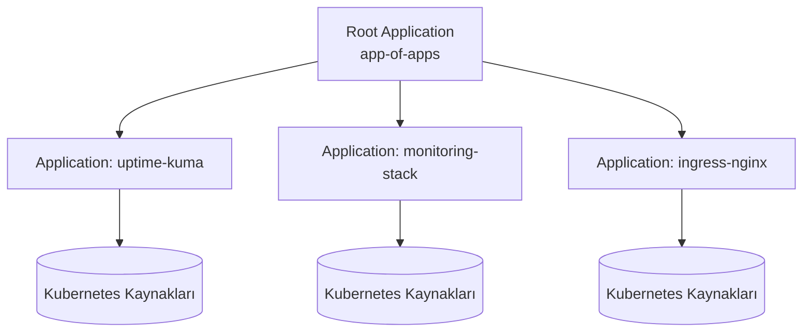

← [README'ye dön](../README.md) | [◀ Önceki: Self-Healing & DR](10-self-healing-disaster-recovery.md)

# 11. Referans Projeler & İleri Seviye Konular

Bu projede kendi script'imle "pull-based GitOps"u basit şekilde simüle ettim. Ancak endüstride GitOps denince akla gelen asıl araç ekosistemi çok daha olgun. Bu bölüm, o ekosistemi tanımak ve bir sonraki öğrenme adımını planlamak için hazırlandı.

## 11.1 Neden Argo CD / FluxCD?

Kendi `reconcile.sh` script'im çalışıyor ama production'da yetersiz kalacak noktalar var:

| İhtiyaç | Benim Script'im | Argo CD / Flux |
|---------|------------------|-----------------|
| Sürekli reconciliation | Cron ile periyodik | Gerçek zamanlıya yakın, event-driven |
| Sağlık kontrolü (health check) | Yok | Var — kaynak "Healthy/Degraded/Progressing" durumu izlenir |
| Görselleştirme | Yok | Argo CD: zengin bir web UI, senkronizasyon diff'i |
| Otomatik rollback | Yok | Var (Flux + Kustomize/Helm ile) |
| Çoklu ortam (dev/staging/prod) yönetimi | Manuel | Kustomize overlay / Helm values ile yapılandırılmış |
| Secret yönetimi | Yok | Sealed Secrets, SOPS, External Secrets Operator entegrasyonu |
| Kubernetes-native | Hayır (VM tabanlı) | Evet — CRD'ler (Application, Kustomization, HelmRelease) |

## 11.2 Argo CD vs FluxCD — Kısa Karşılaştırma

| | **Argo CD** | **FluxCD** |
|---|---|---|
| Arayüz | Zengin web UI, görsel diff | Çoğunlukla CLI/Git odaklı, UI opsiyonel |
| Kurulum modeli | Tek başına controller + UI | Modüler controller'lar (source, kustomize, helm, notification) |
| Çoklu-tenant | App-of-Apps deseni | Native Kustomization/HelmRelease katmanlaması |
| Helm desteği | Yerleşik | Standart + OCI tabanlı Helm chart desteği |
| Öğrenme eğrisi | UI sayesinde başlangıç için kolay | Git/CLI'a aşinaysanız doğal geliyor |

> İkisi de aynı temel prensibi uygular: **Git = istenen durum, controller = gözlemci ve uygulayıcı.** Repo yapıları da (bkz. aşağıdaki `examples/`) neredeyse birebir aynı mantıkla kurulabiliyor.

## 11.3 Bu Repoya Eklediğim Kavramsal Örnekler

Gerçek bir cluster'a bağlı olmasa da, iki aracın nasıl yapılandırıldığını görmek için `examples/` klasörüne minimal örnekler ekledim:

- [`examples/argocd/application.yaml`](../examples/argocd/application.yaml) — bir Argo CD `Application` CRD'si
- [`examples/flux/kustomization.yaml`](../examples/flux/kustomization.yaml) — bir Flux `Kustomization` CRD'si
- [`examples/kustomize/`](../examples/kustomize/) — `base` + `overlays/{dev,prod}` deseniyle çoklu ortam yönetimi

## 11.4 Kustomize & Helm: "Ne Zaman Hangisi?"

| | **Kustomize** | **Helm** |
|---|---|---|
| Yaklaşım | Template'siz, "patch" tabanlı (overlay) | Template motoru (Go templates), parametrik |
| Öğrenme eğrisi | Düşük | Orta — chart yazmayı gerektirir |
| En uygun senaryo | Aynı manifestin ortama göre küçük farklarla değişmesi | Paylaşılabilir, versiyonlanabilir, parametrik paketler (chart) dağıtmak |
| Argo CD/Flux desteği | Native | Native |

## 11.5 App-of-Apps Deseni (Argo CD)

Çok sayıda uygulamayı tek tek elle tanımlamak yerine, **bir "üst" Application'ın diğer Application'ları yönetmesi** deseni:

Bu, tek bir `git push` ile onlarca uygulamanın tutarlı şekilde bootstrap edilmesini sağlıyor.

## 11.6 İncelediğim / İncelenmesi Değerli Açık Kaynak Referanslar

Bu repoyu hazırlarken GitOps repo yapıları konusunda şu kaynaklara baktım; benzer bir yolda ilerleyenlere de öneriyorum:

- **[cloudogu/gitops-patterns](https://github.com/cloudogu/gitops-patterns)** — GitOps repo desenleri, bootstrap/linking/nesting/templating yaklaşımlarının kapsamlı bir taksonomisi.
- **[cloudogu/gitops-playground](https://github.com/cloudogu/gitops-playground)** — Argo CD ve Flux'u aynı anda deneyebileceğiniz, sıfırdan kurulabilen bir GitOps sandbox'ı.
- **[schnatterer/argocd-autopilot-example](https://github.com/schnatterer)** — `argocd-autopilot` ile bootstrap edilmiş örnek bir Argo CD repo yapısı.
- **[onedr0p/cluster-template](https://github.com/onedr0p/cluster-template)** — Flux ile yönetilen, gerçek dünyada kullanılan popüler bir "home-ops" mono-repo şablonu.
- **Argo CD resmi örnekleri** — `argoproj` organizasyonu altındaki örnek uygulama repoları, App-of-Apps deseninin referans uygulaması.

## 11.7 Bir Sonraki Öğrenme Hedeflerim

- [ ] Yerel bir Kubernetes cluster'ında (kind/minikube) Argo CD kurup bu repodaki Uptime Kuma'yı Helm chart olarak deploy etmek
- [ ] Aynı senaryoyu FluxCD ile tekrarlayıp iki aracı doğrudan karşılaştırmak
- [ ] Sealed Secrets veya SOPS ile GitOps'ta secret yönetimini öğrenmek (Git'e düz metin secret koymamak kritik bir konu)
- [ ] Argo Rollouts ile canary/blue-green **progressive delivery** denemek
- [ ] Policy-as-code için OPA/Gatekeeper veya Kyverno ile GitOps akışına politika kontrolü eklemek

---
⬅ [README'ye dön](../README.md)
